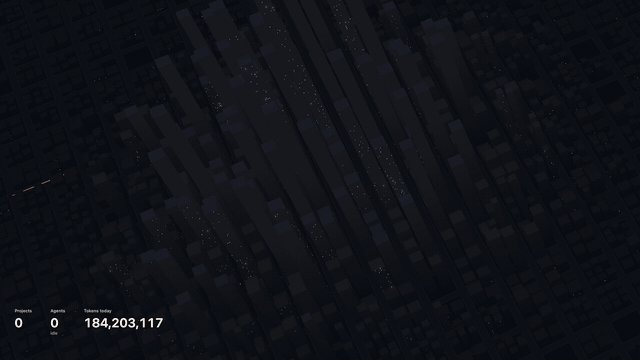

# agent-city

A macOS live wallpaper: a night city that sits dark and quiet while your AI coding
agents are idle, and comes alive while they work — windows light up and Tron-style
light streams flow through the streets. A small overlay shows projects, agents
(with subagents), tokens used today and tokens per minute.



Inspired by [@internetphysics](https://x.com/internetphysics/status/2104305710079119649).

- One continuous panorama across all your displays (each display renders its slice of one camera).
- Works on one, two or three displays: the city is laid out differently for each, chosen from the combined canvas shape (a 21:9 ultrawide gets the single layout, a 32:9 one gets the dual layout).
- Downtown and the stats overlay sit on the left-most display.
- Agent activity merges herdr (when installed) with Claude Code's session logs, so agents count wherever they run — herdr, a terminal, the desktop app.
- Token counts come from Claude Code's logs (`~/.claude/projects/**/*.jsonl`).

## Requirements

- macOS 13+
- Node.js 20+ (found through your login shell, so nvm/homebrew installs work)
- Swift toolchain (Xcode or Command Line Tools) to build
- Optional: herdr

## Install

```bash
make install
```

This builds `AgentCity.app`, copies it to `~/Applications` and launches it. Use the
building icon in the menu bar for **Pause**, **Demo mode**, **Reload scene**,
**Launch at login** and **Quit**.

## How activity is computed

- **Agents** — herdr agents whose status is `working` (`blocked` means waiting on you and
  doesn't count), plus Claude Code sessions outside herdr whose log changed in the last 30s,
  plus subagents whose log changed in the last 30s. Sessions herdr tracks are matched by
  session id, so they're never counted twice and herdr's status wins for them.
- **Projects** — distinct working directories of working agents (worktrees count as their repo).
- **Tokens today** — `input + output + cache creation + cache read` for every assistant
  message logged today (local time), each message counted once.
- **Brightness** — `effective = agents + 0.5 × subagents`; 1 → 45%, 2 → 65%, 4 → 85%, 6+ → ~100%.
  Tokens/min speeds up the traffic. Each project lights up its own district.

## Configuration

Optional `~/.config/agent-city/config.json`:

```json
{
  "port": 47823,
  "includeCacheRead": true,
  "herdrPath": "herdr",
  "claudeProjectsDir": "/Users/you/.claude/projects"
}
```

Set `includeCacheRead` to `false` to count only "fresh" tokens (cache reads dominate totals).
Use an absolute path for `claudeProjectsDir`.

## Development

```bash
make test   # collector + scene unit tests
make dev    # collector + scene on http://127.0.0.1:47823/
```

Useful scene URLs:

- `/?demo=1` — fake activity loop
- `/?fullW=5760&fullH=1080&x=0&w=1920&h=1080` — the left slice of a 3×1080p panorama
- `/?layout=single` (or `dual`, `triple`) — force a city layout instead of picking by canvas shape
- `/?a=0.9` — force an activity level (0–1)

Run the app against your checkout without installing:

```bash
cd app && swift build && AGENT_CITY_ROOT=.. .build/debug/AgentCity
```

## Layout

- `collector/` — Node, zero dependencies: tails logs, polls herdr, serves `/stats`, `/events` (SSE) and the scene.
- `scene/` — Three.js (vendored), no build step: city generation, window shader, light streams, overlay.
- `app/` — Swift menu-bar app: one click-through desktop-level window per display, supervises the collector.
- `promo/` — the launch film: a frame-exact capture of the real scene, a Remotion edit and a synthesized soundtrack (see `promo/README.md`).

## Troubleshooting

- Collector log: `~/Library/Logs/AgentCity/collector.log`
- `curl -s 127.0.0.1:47823/stats` shows what the wallpaper sees.
